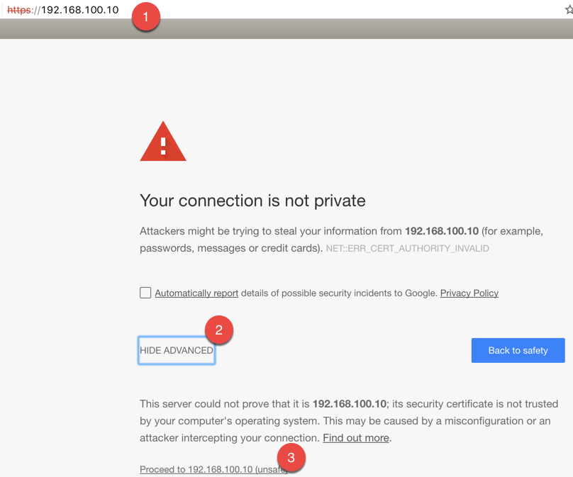
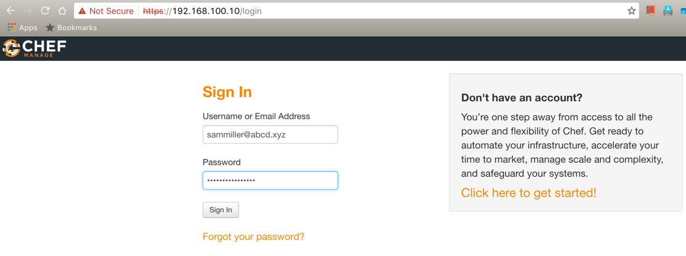
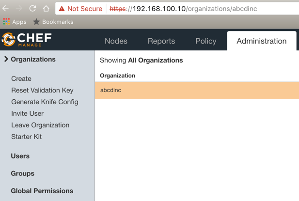
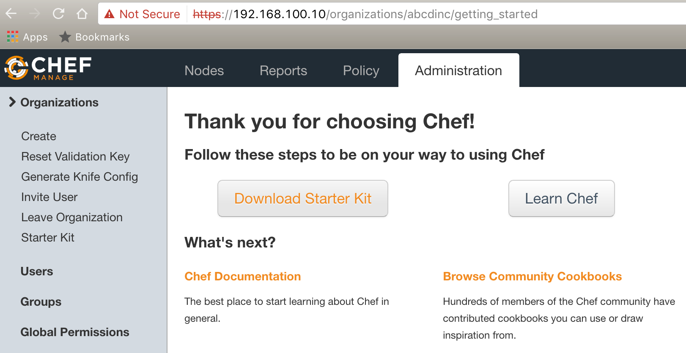
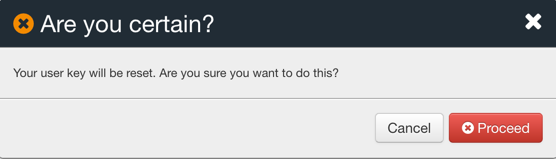
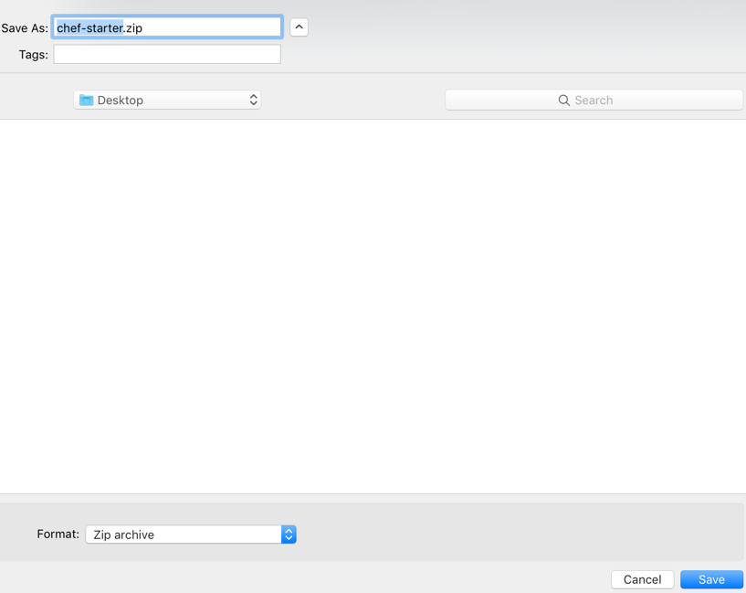
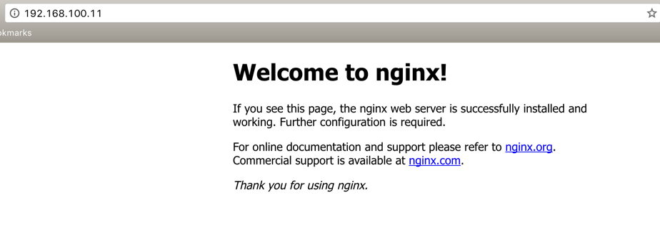

# How to setup a Chef Server, Workstation and manage a node with it

This post aims to provide step-by-step guide to setup a Chef Server, WorkStation and a node to be managed by Chef Server.

### Pre-requisites:

1. If you are going to run locally or setup just to learn.
  * Vagrant and VirtualBox installed and configured on your computer.
  * Other choice would be creating virtual machines using VMWare WorkStation.

2. If you have instance on the cloud like AWS or GCP, that is fine too. Have your cloud instance details such as IP address or FQDN handy.

We will use Ubuntu 16.04 for this exercise. It will also work on other versions of Ubuntu too however not tested.

There are three parts in this guide.

[Part 1 - Setup Chef Server](#setup-chef-server)

[Part 2 - Setup Chef Node](#setup-chef-node)

[Part 3 - Setup Chef WorkStation](#setup-chef-workstation)


<a href="setup-chef-server"></a>
# Part 1: Setup Chef Server

Step 1:- Create a directory.

    mkdir ~/chefserver
    cd ~/chefserver

Step 2:- Create a `Vagrantfile` with the following content. Use a nice text editor like [Atom](https://atom.io/) or [Sublime Text](https://www.sublimetext.com/) to do so.

    # -*- mode: ruby -*-
    # vi: set ft=ruby :
    VAGRANTFILE_API_VERSION = 2
    BOX = "bento/ubuntu-16.04"
    Vagrant.configure(VAGRANTFILE_API_VERSION) do |config|
      # Chef Server config starts here.
      config.vm.define "chefserver" do |server|
      server.vm.box = BOX
      server.vm.hostname = 'chefserver.abcd.xyz'
      server.vm.network "private_network", ip: "192.168.100.10", virtualbox__hostonly: true
      server.vm.provider :virtualbox do |vb|
          vb.customize ["modifyvm", :id, "--memory", "2048"]
          vb.gui = true
      end
      # Chef node config
      config.vm.define "chefnode" do |node|
        node.vm.box = BOX
        node.vm.hostname = 'chefnode.abcd.xyz'
        node.vm.network "private_network", ip: "192.168.100.11", virtualbox__hostonly: true
        node.vm.provider :virtualbox do |vb|
            vb.customize ["modifyvm", :id, "--memory", "512"]
            # vb.gui = true
        end
      end
      # Chef Workstation config starts here
      config.vm.define "chefws" do |ws|
        ws.vm.box = BOX
        ws.vm.hostname = 'chefws.abcd.xyz'
        ws.vm.network "private_network", ip: "192.168.100.12", virtualbox__hostonly: true
        ws.vm.provider :virtualbox do |vb|
            vb.customize ["modifyvm", :id, "--memory", "512"]
            vb.gui = true
        end
      end
    end

We are using  [ubuntu-16.04](https://atlas.hashicorp.com/bento/boxes/ubuntu-16.04) box for VirtualBox from [bento](https://github.com/chef/bento). There are boxes for other providers such as VMWare WorkStation.

If you are bored and want to see what is happening or want to troubleshoot when you do `vagrant up` command, just set `VAGRANT_LOG` environment variable to DEBUG. eg., `export VAGRANT_LOG=DEBUG`.

Step 3:- Use vagrant up to boot only chefserver.

    vagrant up chefserver

It will take a while depends on your internet speed as it has to download the vagrant box from Internet. If you have a vagrant box locally, use it. However I strongly recommend you use bento images as they are tested and updated regularly.

Step 4:- Login/SSH in to your machine and install __Chef Server__ and Configure.:

    vagrant ssh chefserver

Then you will get a prompt like this.

    vagrant@chefserver:~$

~> Note: If you are not using vagrant, just ssh in to your machine.

Step 5: On the chefserver you just logged in, run `update`:

    sudo apt-get update

You will be executing commands on the __Chef Server__ you have just created from now on.

Step 6: Get the chef-server download URL from [Chef website](https://downloads.chef.io/chef-server/#ubuntu) using your laptop and use `wget` to download it to `/tmp` directory on Chef Server.

    wget https://packages.chef.io/files/stable/chef-server/12.11.1/ubuntu/16.04/chef-server-core_12.11.1-1_amd64.deb -O /tmp/chef-server-core_12.11.1-1_amd64.deb

~> It is worth to have a look for newer version on chef website. `12.11.1-1` is the latest version at the time (Jan 2017) of writing this.

Step 7: Install the downloaded chef-server package:

    sudo dpkg -i /tmp/chef-server-core_12.11.1-1_amd64.deb

Step 8: Run the configuration and go for a cup of coffee as it is going to take a while.

    sudo chef-server-ctl reconfigure


Step 9: Create a user on chef server.

    sudo chef-server-ctl user-create sammiller Sam Miller sammiller@abcd.xyz 'My$ecuRePassword' --filename /etc/chef/sammiller.pem

`sammiller` - Username.

`Sam` - First Name.

`Miller` - Last Name.

`sammiller@abcd.xyz` - EMail Address.

`'My$ecuRePassword'` - password in single-quotes.

`/etc/chef/sammiller.pem` - user key file to communicate with Chef Server securely.

Verify you have created a chef-server user successfully.

    sudo chef-server-ctl user-list

Should return something like this.

    pivotal
    sammiller

Step 10: Create an organization and attach the user `sammiller` to belong to the organization.

    sudo chef-server-ctl org-create abcdinc 'ABCD, Inc.' --association_user sammiller --filename /etc/chef/abcdinc-validator.pem

`abcdinc` - Short Organization Name.

`'ABCD, Inc.'` - Full Organization Name in quotes.

`sammiller` - Username to bind the org with.

`/etc/chef/abcdinc-validator.pem` - validator key file.

Verify you have created a chef-server user successfully.

    sudo chef-server-ctl org-list

Should return something like this.

    abcdinc

Verify that you have the `pem` files created for your user and organization.

    ls /etc/chef

Output should be something similar to this.

    abcdinc-validator.pem  sammiller.pem

We need these two files later on when we configure our workstation.

Step 11:  Get the chef-manage download URL from [Chef website](https://downloads.chef.io/manage/2.4.4#ubuntu) and use `wget` to download it to `/tmp` directory.

      wget -O /tmp/chef-manage_2.4.4-1_amd64.deb https://packages.chef.io/files/stable/chef-manage/2.4.4/ubuntu/16.04/chef-manage_2.4.4-1_amd64.deb

~> Note: If you are download this package other than `/tmp` directory, make sure you have write access rights on the directory.

Step 12: Install the downloaded chef-manage package.

    sudo dpkg -i /tmp/chef-manage_2.4.4-1_amd64.deb

Step 13: Execute `reconfigure` command again.

    sudo chef-server-ctl reconfigure

Step 14: Execute `reconfigure` command using `chef-manage-ctl`.

    sudo chef-manage-ctl reconfigure

You will be prompted with this

    To use this software, you must agree to the terms of the software license agreement.
    Press any key to continue.

Press `ENTER` or any other key. You will be given with links to licenses on the screen, press `q` to exit out.

Then you will be asked to say `yes` on the blinking cursor prompt to agree to their agreements, just say `yes`.

    Type 'yes' to accept the software license agreement, or anything else to cancel.

Watch it configuring chef-manage. Once completed, your terminal screen end will look like this.

    Running handlers:
    Running handlers complete
    Chef Client finished, 87/188 resources updated in 38.761173736 seconds
    chef-manage Reconfigured!

Step 15: Verify that your Chef Server is accessible via Browser.
Go to your favorite browser and navigate to your Chef Server's IP address or FQDN.





<!-- 


 -->

~> Note: Make your `hosts` file aware of the __chefserver__'s IP address on the machine from which you are trying this. Guide on this can be found [here](https://support.rackspace.com/how-to/modify-your-hosts-file/).

My hosts file looks like this.

    ##
    # Host Database
    #
    # localhost is used to configure the loopback interface
    # when the system is booting.  Do not change this entry.
    ##
    127.0.0.1       localhost jenkins.local
    255.255.255.255 broadcasthost
    ::1             localhost

    192.168.100.10  chefserver.abcd.xyz   chefserver

  echo '192.168.100.11  chefws.abcd.xyz   chefws' >> /etc/hosts
  echo '192.168.100.11  chefnode.abcd.xyz   chefnode' >> /etc/hosts

Verify that the machine is accessible from your host by requesting via PING command.

    ping 192.168.100.10

You should see something like this as output.

    PING 192.168.100.10 (192.168.100.10): 56 data bytes
    64 bytes from 192.168.100.10: icmp_seq=0 ttl=64 time=0.418 ms
    64 bytes from 192.168.100.10: icmp_seq=1 ttl=64 time=0.381 ms
    ^C
    --- 192.168.100.10 ping statistics ---
    2 packets transmitted, 2 packets received, 0.0% packet loss
    round-trip min/avg/max/stddev = 0.381/0.399/0.418/0.019 ms

Ping with FQDN

    ping chefserver.abcd.xyz

You should see something like this as output.

    PING chefserver.abcd.xyz (192.168.100.10): 56 data bytes
    64 bytes from 192.168.100.10: icmp_seq=0 ttl=64 time=0.242 ms
    64 bytes from 192.168.100.10: icmp_seq=1 ttl=64 time=0.377 ms
    64 bytes from 192.168.100.10: icmp_seq=2 ttl=64 time=0.276 ms
    ^C
    --- chefserver.abcd.xyz ping statistics ---
    3 packets transmitted, 3 packets received, 0.0% packet loss
    round-trip min/avg/max/stddev = 0.242/0.298/0.377/0.057 ms


<a href="setup-chef-node"></a>
# Part 2: Setup Chef Node (to manage with Chef Server):

    vagrant up chefnode

    vagrant ssh chefnode

On Chef node:

    sudo -i
    echo '192.168.100.10  chefserver.abcd.xyz  chefserver' >> /etc/hosts

<a href="setup-chef-workstation"></a>
# Part 3: Setup Chef WorkStation

Some people prefer to set-up workstation VM without having to mess the local laptop or desktop they have. You can also use this guide to set up your local WorkStation, just skip the VM creation part.

Step 1: Boot up the machine using `vagrant up`

    vagrant up chefws

~> Note: Since you have added a new machine to spin up. Vagrant will bring another machine up with a name `chefws`.

Step 2: Login/SSH to your Chef WorkStation.

    vagrant ssh chefws

~> Note: Use `chefws` with `vagrant ssh` command to login to the _Chef WorkStation_.

Step 3: Edit `/etc/hosts` file on __Chef WorkStation__ and add an entry at the end of the file.

  echo  '192.168.100.10 chefserver.abcd.xyz  chefserver' >> /etc/hosts
  echo  '192.168.100.12 chefnode.abcd.xyz  chefnode' >> /etc/hosts

Verify using PING command to see if the __Chef Server__ is reachable from __Chef WorkStation__.

Step 4: Get [ChefDK download URL](https://downloads.chef.io/chefdk) from Chef website and install it on your _Chef WorkStation_.

    wget -O /tmp/chefdk_1.1.16-1_amd64.deb https://packages.chef.io/files/stable/chefdk/1.1.16/ubuntu/16.04/chefdk_1.1.16-1_amd64.deb

 Step 5: Install ChefDK on your Chef WorkStation:

    sudo dpkg -i /tmp/chefdk_1.1.16-1_amd64.deb

 Step 6: Verify your ChefDK installation

    chef verify

Step 7: Make your Chef WorkStation to use `ruby` provided by Chef:

    echo 'eval "$(chef shell-init bash)"' >> ~/.bash_profile
    source ~/.bash_profile

Step 8: Verify that you are using ChefDK `ruby`.

    which ruby

Output looks like this.

    /opt/chefdk/embedded/bin/ruby

Step 9: Generate `chef-repo` on your home directory of Chef WorkStation.

    chef generate app chef-repo

Verify that it has generated a directory `chef-repo` to start with.

    ls ~
    chef-repo

Step 10: Change your current directory to `chef-repo` and create `.chef` directory on it.

    cd chef-repo
    mkdir .chef
    cd .chef

Step 11: Copy /etc/chef/abcdinc-validator.pem  /etc/chef/sammiller.pem from __Chef Server__ to __Chef WorkStation__. Run the following command on your __Chef WorkStation__.

    scp vagrant@192.168.100.10:/etc/chef/*.pem /home/vagrant/chef-repo/.chef

Password is `vagrant`

For ZSH users, escape wildcard like this.

    scp vagrant@192.168.100.10:/etc/chef/\*.pem /home/vagrant/chef-repo/.chef

Make sure you have keys downloaded at `/home/vagrant/chef-repo/.chef`

    ls /home/vagrant/chef-repo/.chef
    # Output would be
    # abcdinc-validator.pem   sammiller.pem

Step 12: Create `knife.rb` file in `/home/vagrant/chef-repo/.chef` with following contents:

    current_dir = File.dirname(__FILE__)
    log_level                :info
    log_location             STDOUT
    node_name                "sammiller"
    client_key               "#{current_dir}/sammiller.pem"
    chef_server_url          "https://chefserver.abcd.xyz/organizations/abcdinc"
    cookbook_path            ["#{current_dir}/../cookbooks"]

Step 13: Fetch the certificate from __Chef Server__:

    cd ~/chef-repo
    knife ssl fetch

Step 13a (Optional): Only if you encounter with error, login to your Chef Server and copy the certificate (chefserver.abcd.xyz.crt) from `/var/opt/opscode/nginx/ca/` to `/tmp` directory of the server.

Open another terminal window/tab on your local machine and login to Chef Server

    cd ~/chefserver
    vagrant ssh chefserver

On the __Chef Server__, execute the following

    sudo -i
    cp /var/opt/opscode/nginx/ca/chefserver.abcd.xyz.crt /tmp
    scp /tmp/chefserver.abcd.xyz.crt vagrant@192.168.100.12:/home/vagrant/chef-repo/.chef/trusted_certs/chefserver.abcd.xyz.crt
    # Input password `vagrant` when prompted.
    exit
    exit

Step 14: Go back to __Chef WorkStation__ and execute the following:

    cd ~/chefserver
    vagrant ssh chefws

    cd /home/vagrant/chef-repo/.chef
    knife ssl check

The output should look like this.

    Connecting to host chefserver.abcd.xyz:443
    Successfully verified certificates from `chefserver.abcd.xyz`

Step 15: Execute the following to check, WorkStation is able to make connection and retrieve client details:

    knife client list

Output should look similar to this.

    abcdinc-validator

Step 16: Upload a cookbook to `/home/vagrant/chef-repo/cookbooks/`

```
    cd /home/vagrant/chef-repo/cookbooks/
    git clone https://github.com/sirajudheenam/nginx-passenger.git
    knife supermarket download apt
    knife supermarket download yum
    knife supermarket download compat_resource
    tar -xvf apt*.gz
    tar -xvf yum*.gz
    tar -xvf compat_resource*.gz
    rm -f *.tar.gz
    knife cookbook upload nginx-passenger
    knife cookbook list
    # Output should look similar to this.
    # apt               5.0.1
    # compat_resource   12.16.3
    # nginx-passenger   0.1.1
    # yum               4.1.0

```


Step 17: Execute the bootstrap the node and run the cookbook recipe `nginx-passenger`:

    cd /home/vagrant/chef-repo/

    knife bootstrap vagrant@chefnode.abcd.xyz -P vagrant -N nginxnode --sudo --use-sudo-password --run-list 'recipe[nginx-passenger]'

The truncated output would be

    Connecting to chefnode.abcd.xyz
    chefnode.abcd.xyz -----> Existing Chef installation detected
    chefnode.abcd.xyz Starting the first Chef Client run...
    chefnode.abcd.xyz Starting Chef Client, version 12.17.44
    chefnode.abcd.xyz resolving cookbooks for run list: ["nginx-passenger"]
    chefnode.abcd.xyz Synchronizing Cookbooks:
    chefnode.abcd.xyz   - apt (5.0.1)
    chefnode.abcd.xyz   - nginx-passenger (0.1.1)
    chefnode.abcd.xyz   - compat_resource (12.16.3)
    chefnode.abcd.xyz   - yum (4.1.0)
    .
    .
    .
    chefnode.abcd.xyz Running handlers:
    chefnode.abcd.xyz Running handlers complete
    chefnode.abcd.xyz
    chefnode.abcd.xyz Deprecated features used!
    chefnode.abcd.xyz   Cloning resource attributes for apt_update[update] from prior resource
    chefnode.abcd.xyz Previous apt_update[update]: /var/chef/cache/cookbooks/nginx-passenger/recipes/default.rb:10:in `from_file'
    chefnode.abcd.xyz Current  apt_update[update]: /var/chef/cache/cookbooks/nginx-passenger/recipes/default.rb:23:in `from_file' at 1 location:
    chefnode.abcd.xyz     - /var/chef/cache/cookbooks/nginx-passenger/recipes/default.rb:23:in `from_file'
    chefnode.abcd.xyz    See https://docs.chef.io/deprecations_resource_cloning.html for further details.
    chefnode.abcd.xyz
    chefnode.abcd.xyz Chef Client finished, 4/22 resources updated in 24 seconds


Check for any errors and troubleshoot them.

Step 18: Navigate your browser to `http://192.168.100.11` and you should see something like this:

